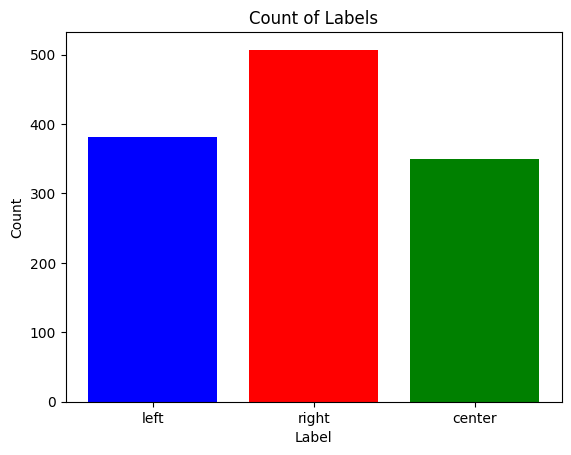

# ML/AI for Clarity

This document details the data collection, processing, training procedures, final models and deployment strategies used in Clarity.

---

## Table of Contents

- [Intro](#intro)
- [Data Collection](#data-collection)
- [Processing Data](#processing)
- [Training Pipeline](#trainingtesting)
- [Model Architecture](#architecture)
- [Limitations](#current-limitations)
- [Future](#future)

---

## Intro

For our use case, we need a classification model specially trained on shorter texts like Facebook posts or Reddit posts. A popular model for such a task (predicting bias and topics of a short post) does not exist or if it did I couldn't find it, so we opted to build our own.

---

## Data Collection

All data is collected from social media sites as those will be the targets of our model and extension. The code for data collection can be found in the data folder. 

#### Topic

For topic data we collected text, source, topic, website and date. The data predominantly comes from Reddit, through subreddits or topic pages. For instance, the tech subreddit or the world news topic page. As some data here still comes from Facebook, we separate the two through keeping track of which website we obtained the data from. Data will be stored into a local PostgresDB.

#### Bias

For bias data we collected text and their source from the Facebook pages of prominent news sites such as NYT, BBC, or Fox. The text and source is stored into a local PostgresDB as shown below.

---

## Processing

We display the data distribution to visualize imbalanced data. We want to avoid imbalanced data as it can lead to naive models that guess the most often occuring label. In the future we will handle imbalanced data through downsampling majority classes, and collect more samples for minority classes. 

Each pipeline has their respective data labeling, but share tokenizing methods through a pretrained Bert Tokenizer. 

#### Topic

Using the source column of our topic database, we label our data points according to a [topic schema](/model_creation/schemas/topics.py) (e.g. news_and_politics is labeled politics or ESPN is labeled sport). With our data labeled we can implement classified machine learning utilizing algorithms from scikit-learn or classified deep learning using PyTorch neural networks.

On each instance of getting an item from the dataset, we tokenize the text which is our only feature for the model and categorize the label (e.g. business -> 0, food -> 1, gaming -> 2...). 

#### Bias

With the sources from our bias database, we label our data points according to a [bias schema](/model_creation/schemas/bias.py). The schema reflects [allsides media bias chart](https://www.allsides.com/media-bias/media-bias-chart) so we label NYT as left leaning news, BBC as central leaning news and Fox as right leaning just to list a few.

Similarly to the topic pipeline, we tokenize the text on each instance of getting an item from our dataset. The only major difference is labeling: left -> 0, right -> 1, center -> 2.

---

## Training/Testing

Our training and testing loop is standard utilizing an Adam optimizer, and cross entropy as our loss function. The finalized model is saved in an onnx format for use in the frontend extension.

At the end of each training iteration we plot the accuracy on each epoch to easier visualize how our model is doing/improving. Furthermore, we also plot the confusion matrix to compare what our model is predicting versus the actual label.

#### Topic

The topic model currently leans heavily towards politics (3 in the confusion matrix) probably due to a data imbalance. So the overall accuracy is terrible at ~40%, and needs huge improvements before being usable. Thus it is disabled by default on the extension.

#### Bias

The bias model gets the majority of each class correct, at a test loss of ~70%. As such, this model is usable and enabled by default on the extension, but further improvements are desired. 

---

## Architecture

The model architecture is obtained through opening our onnx mdoel on [Netron](netron.app). But essentially is: input -> embedding layer -> linear -> Leaky Relu -> linear -> Softmax -> output. Currently, both model shares the same architecture.

The overall architecture for the entire topic classification is as shown: 

---

## Current Limitations

#### Language and Region

The bias model is predominantly trained on U.S. politics and entirely in english, so the bias classification is more inaccurate for politics in other countries and languages. Thus we must accomodate through adding more data from worldwide politics. However, having a model work on many languages is outside the scope of this project.

#### Corporations vs Individuals

Another limitation is our bias model is trained with data from NYT or FOX and other large companies. However, many people get their news from individuals rather than companies so data from individual content creators needs to be collected as well. Due to how companies and individual creators have very different semantics when speaking on sensitive topics, the model will be slightly more inaccurate when classifying political posts made by individuals. 

---

## Future

As the way we speak, consume, and create news gradually change over time. Politics, the people involved, the things that matter most to voter, and the state of the world also changes over time. As such the model has to be constantly retrained on newer data to keep up to date with how the left and right approach news and politics. 

Other future additions will be keeping track of the accuracy of each model, major improvements to the topic prediction model, and data balancing.

